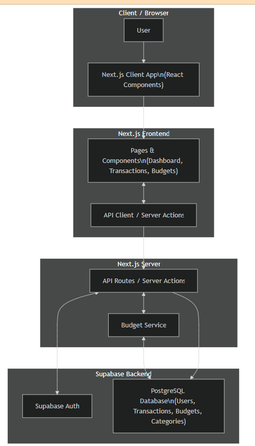

# BudgetBuddy Architecture

## 1. High-Level Component Diagram

BudgetBuddy is a personal finance tracking app. Users interact with the Next.js (React) frontend through the browser. The frontend uses server actions and API routes to communicate with Supabase for authentication and the PostgreSQL database to manage transactions, budgets, and categories.
