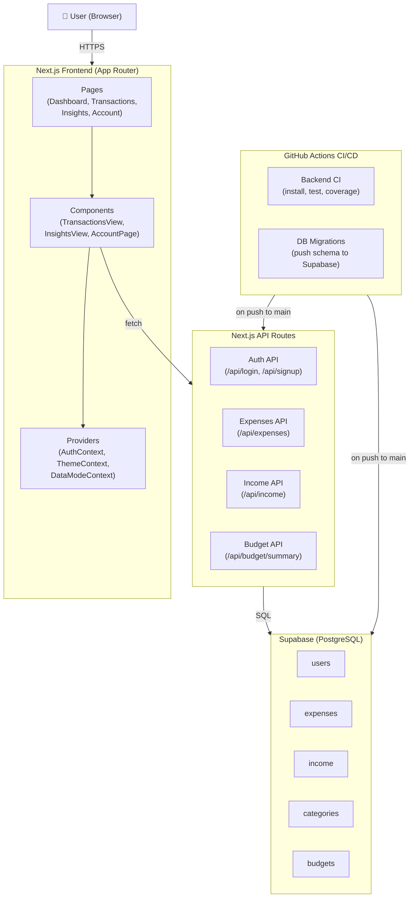
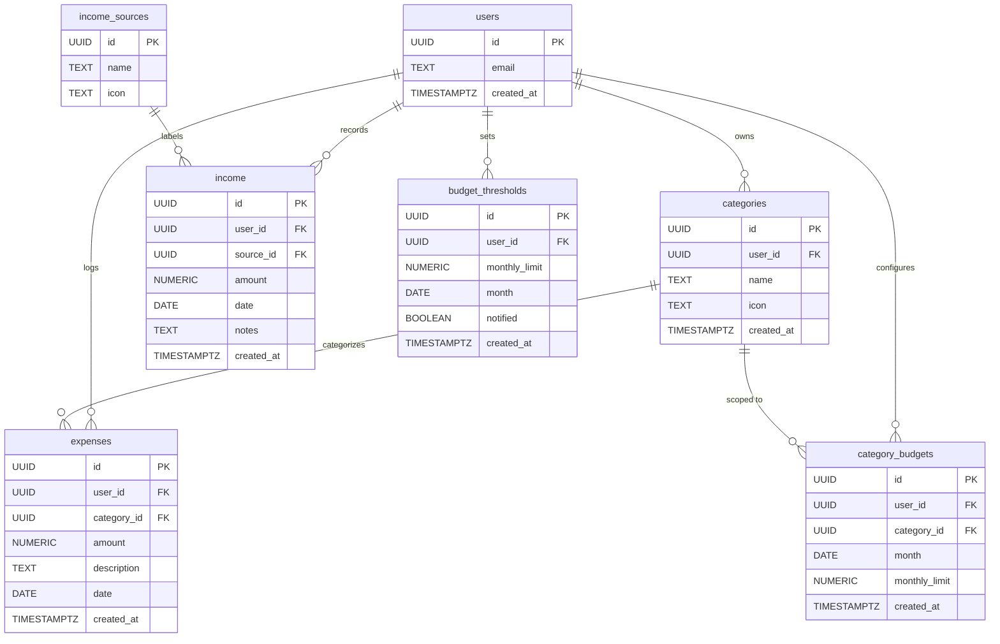

# BudgetBuddy Architecture

## Step 1: High-Level Component Diagram

The BudgetBuddy application is structured as a full-stack Next.js application. The **frontend** consists of React pages and components powered by context providers that manage authentication state, theme preferences, and data mode (live vs. sample). The **backend** is built using Next.js API routes that handle authentication, expenses, income, and budget summary operations. All persistent data is stored in a **Supabase PostgreSQL database**, which includes tables for users, expenses, income, categories, and budgets. A **GitHub Actions CI/CD pipeline** runs automatically on every push to main, executing backend tests and pushing any database schema migrations to Supabase.

---

## Step 2: Entity Relationship Diagram

The BudgetBuddy database is organized around the **users** table, which is the central entity that owns all financial data. Each user can log **expenses**, which are optionally linked to a **category** (e.g. Food, Shopping, Health). Users can also record **income** entries, each linked to a shared **income_sources** table (e.g. Salary, Freelance). Budget tracking is handled through two tables: **budget_thresholds** stores a user's overall monthly spending limit and tracks whether an alert has been sent, while **category_budgets** allows users to set per-category monthly limits for more granular budget planning.

---