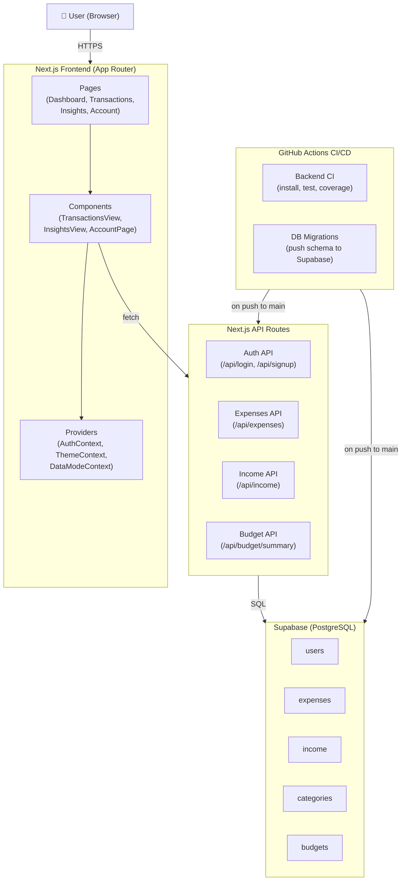

# BudgetBuddy Architecture
# BudgetBuddy Architecture

## Step 1: High-Level Component Diagram

The BudgetBuddy application is structured as a full-stack Next.js application. The **frontend** consists of React pages and components powered by context providers that manage authentication state, theme preferences, and data mode (live vs. sample). The **backend** is built using Next.js API routes that handle authentication, expenses, income, and budget summary operations. All persistent data is stored in a **Supabase PostgreSQL database**, which includes tables for users, expenses, income, categories, and budgets. A **GitHub Actions CI/CD pipeline** runs automatically on every push to main, executing backend tests and pushing any database schema migrations to Supabase.

---