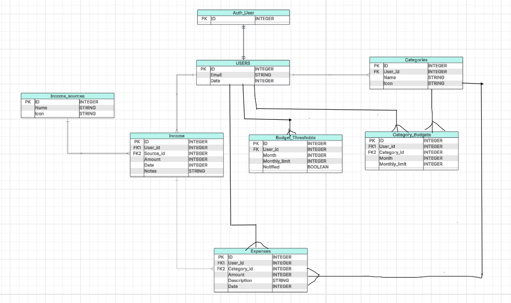
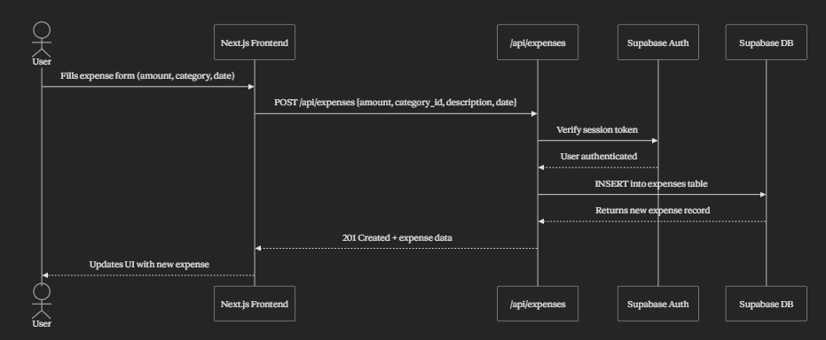

# BudgetBuddy Architecture

## High-Level Component Diagram

BudgetBuddy follows a Next.js full-stack architecture. The user accesses the application via the browser over HTTPS. The frontend is composed of pages (Dashboard, Transactions, Insights, Account), reusable components (TransactionsView, InsightsView, AccountPage), and context providers (AuthContext, ThemeContext, DataModeContext) that manage global state. The frontend communicates with Next.js API routes via fetch calls, which handle Auth, Expenses, Income, and Budget operations using SQL queries against a Supabase PostgreSQL database. GitHub Actions handles CI/CD by running tests and pushing schema migrations to Supabase on every push to main.

## Entity Relationship Diagram

The database is composed of 8 tables. AUTH_USERS is provided by Supabase and backs the USERS table which stores user profile data. Each user can own multiple CATEGORIES and INCOME_SOURCES, which are used to classify EXPENSES and INCOME entries respectively. BUDGET_THRESHOLDS allows users to set an overall monthly spending limit with a notification flag, while CATEGORY_BUDGETS allows users to set spending limits per category per month. All tables are linked to a specific user through a user_id foreign key, ensuring data is scoped per user.

## Call Sequence Diagram

This diagram illustrates the flow of adding a new expense, one of the core features of BudgetBuddy. The user fills out the expense form on the frontend and submits it. The frontend sends a POST request to the /api/expenses API route with the expense details. The API route first verifies the user's session token with Supabase Auth to ensure the request is authenticated. Once confirmed, it inserts the new expense record into the Supabase database. The database returns the created record, which the API sends back to the frontend as a 201 response, and the UI is updated to reflect the new expense.
