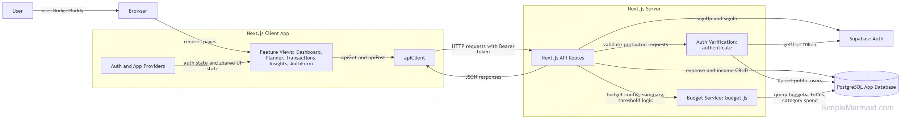
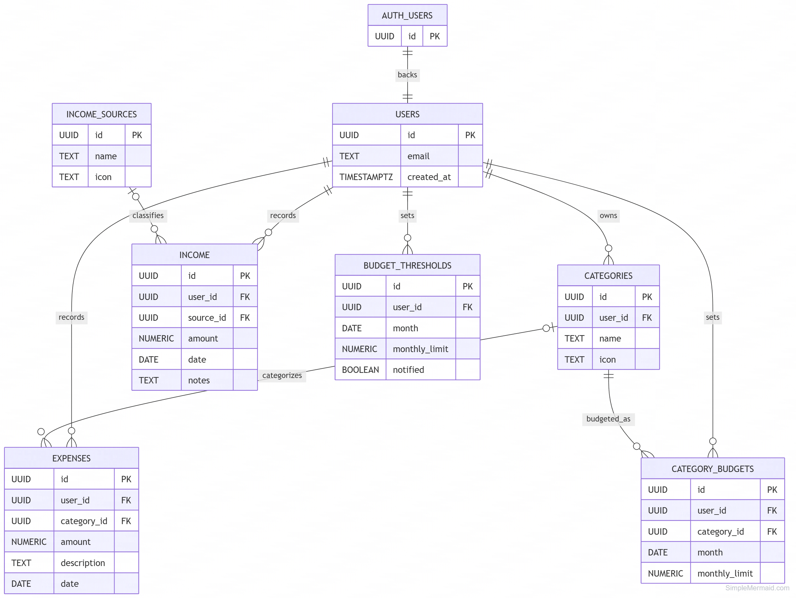
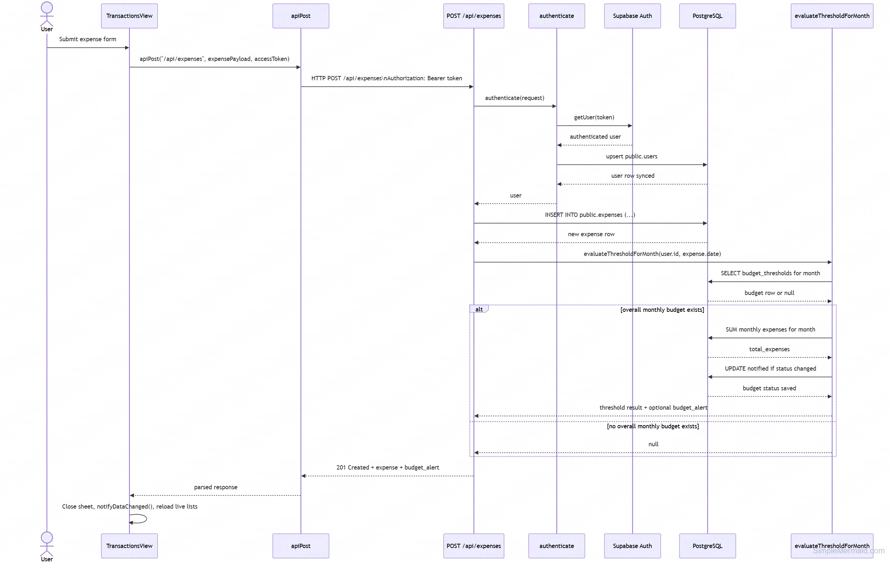

# BudgetBuddy Architecture

This document summarizes the implemented architecture of BudgetBuddy based on the current repository. The diagrams focus on the live application structure, the core budgeting data model, and one end-to-end budgeting flow.

## High-Level Component Diagram

This diagram shows how the main parts of BudgetBuddy work together at runtime. The user interacts with the Next.js client app, which manages session and shared UI state through React providers and sends authenticated requests through a small API client layer. Those requests go to Next.js API routes, which validate the user with Supabase Auth, apply budgeting logic where needed, and read or write application data in PostgreSQL.

## Entity Diagram

This diagram shows the main database entities involved in budgeting, expense tracking, and income tracking. It reflects the real schema used in the repo: expenses and income are stored separately, categories can be global or user-owned, overall monthly limits are stored in `budget_thresholds`, and per-category monthly plans are stored in `category_budgets`. To keep the diagram readable, it focuses on the core tables and relationships rather than every column and index.

## Call Sequence Diagram

This diagram follows the live flow for adding an expense from the Transactions screen. After the user submits the form, the app sends an authenticated request to the expenses API route, which verifies the user, inserts the expense, and then checks whether the month has crossed the overall budget limit. The sequence is simplified to the main budgeting path so the key business logic is easy to follow.
